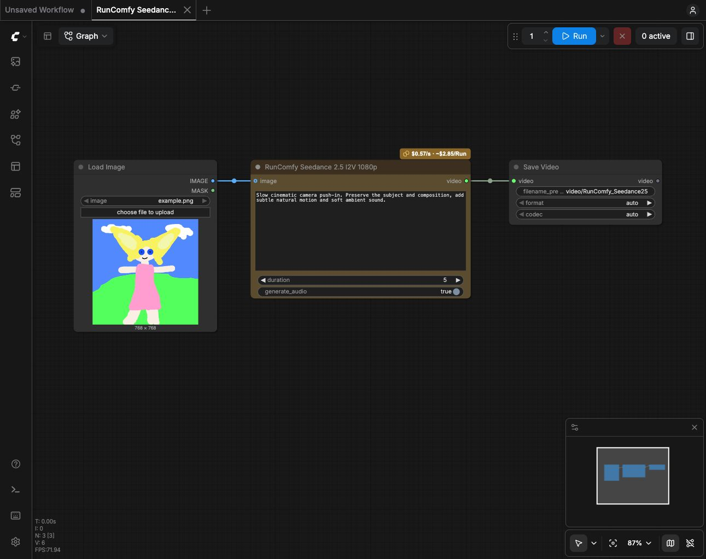

# RunComfy Partner Nodes for ComfyUI

Use **120 RunComfy model nodes across 31 families** inside ComfyUI, with live Model API pricing and your own RunComfy API Token. Each endpoint has its own node and one native `IMAGE`, `VIDEO` or `AUDIO` output.

Recent additions include GPT Image 2.5, Qwen Image 2.1 and 3.0, Gemini Omni Flash, MiniMax H3, LTX 2.5, PixVerse V6 and C1, Kling 3.0 and O3, Wan 2.7 and 3.0, Runway Aleph 2, Ideogram 4, Seed Audio and music generation. See the [complete catalog, release sources and limitations](docs/recent-models.md).



```text
Load Image → RunComfy Seedance 2.5 I2V 1080p → Save Video
```

## Models and example workflows

Search for `RunComfy` followed by the model name. Nodes appear under `RunComfy/Video`, `RunComfy/Image` and `RunComfy/Audio`. The table below contains the original starter workflows; the [full catalog](docs/recent-models.md) covers the expanded model set. Add another model directly from node search and connect its native output to Save Video, Save Image or Save Audio.

| Model | Required reference for a new generation | Output | Example |
| --- | --- | --- | --- |
| Seedance 2.5 I2V 1080p | One image | VIDEO | [Workflow](example_workflows/seedance-25-i2v-1080p.json) |
| Seedance 2.5 T2V 1080p | None | VIDEO | [Workflow](example_workflows/seedance-2.5-t2v-1080p.json) |
| Seedance 2.5 Reference to Video 1080p | References optional | VIDEO | [Workflow](example_workflows/seedance-2.5-reference-1080p.json) |
| Seedance 2.5 I2V 4K | One image | VIDEO | [Workflow](example_workflows/seedance-2.5-i2v-4k.json) |
| Seedance 2.5 T2V 4K | None | VIDEO | [Workflow](example_workflows/seedance-2.5-t2v-4k.json) |
| Seedance 2.5 Reference to Video 4K | At least one video | VIDEO | [Workflow](example_workflows/seedance-2.5-reference-4k.json) |
| Wan 3.0 Prime I2V | First image; optional end image | VIDEO | [Workflow](example_workflows/wan-3.0-prime-i2v.json) |
| Wan 3.0 I2V | First image; optional end image | VIDEO | [Workflow](example_workflows/wan-3.0-i2v.json) |
| FLUX 3 Video | None | VIDEO | [Workflow](example_workflows/flux-3-t2v.json) |
| Nano Banana 2 Lite T2I | None | IMAGE | [Workflow](example_workflows/nano-banana-2-lite-t2i.json) |
| Nano Banana 2 Lite Edit | 1–10 images | IMAGE | [Workflow](example_workflows/nano-banana-2-lite-edit.json) |
| Seedream 5.0 Pro I2I | 1–10 images | IMAGE | [Workflow](example_workflows/seedream-5.0-pro-i2i.json) |

Five new ready-to-import workflows are in [recent model examples](examples/README.md): GPT Image 2.5 Flare, MiniMax H3, LTX 2.5 Audio to Video, Seed Audio and ACE-Step 1.5.

FLUX's website URL ends in `/flux-3/video`, while its canonical Model API ID is `blackforestlabs/flux-3/text-to-video`. The node uses the canonical ID.

## Install

Use a recent ComfyUI with native `VIDEO` and `Save Video` support, and Python 3.10 or newer.

```sh
cd /path/to/ComfyUI/custom_nodes
git clone --branch main https://github.com/runcomfy-com/comfyui-runcomfy-partner-nodes.git
/path/to/ComfyUI/python -m pip install -r comfyui-runcomfy-partner-nodes/requirements.txt
```

For an existing local checkout, copy or symlink this repository into `ComfyUI/custom_nodes` instead. Use **ComfyUI's Python interpreter**, not a different system Python. Restart ComfyUI after installation.

## Configure your account

Open **Settings → RunComfy → Account → API Token → Configure account** to enter your RunComfy API Token from [RunComfy Profile](https://www.runcomfy.com/profile). This account is shared by all RunComfy nodes. The dialog sends it to your ComfyUI server, validates it using a read-only model request, and stores it in an ignored `runcomfy_config.json` file with owner-only permissions.

For self-managed instances, you can also configure the default environment account:

```sh
export RUNCOMFY_API_TOKEN='your-own-api-token'
python main.py
```

Credential precedence is **saved configuration → `RUNCOMFY_API_TOKEN` → `RUNCOMFY_TOKEN`**. Saving a new token explicitly switches the account used for pricing and subsequent generations. With no saved token, the environment account is used automatically. Choose **Clear saved token** to return to that default; leaving the replacement field blank keeps the current configuration. The dialog shows a masked saved indicator and the active credential source without returning the token to the browser. On self-managed instances, `RUNCOMFY_CONFIG_PATH` can point to a protected config location outside the plugin directory. Credentials are never node inputs or part of workflow JSON.

On managed RunComfy machines, startup provides the default machine owner's account token through `RUNCOMFY_API_TOKEN`. A token explicitly saved in Settings overrides it, including when the injected default is unavailable. `RUNCOMFY_API_TOKEN_FILE` marks this managed connection: without a saved override or injected token, account access stops instead of falling back to legacy `RUNCOMFY_TOKEN`. The plugin never reads the injected token file. Restart the machine to refresh a rotated default token. This behavior requires the matching RunComfy machine-startup rollout; installing this plugin alone does not provision machine credentials.

**Cloud Save and account persistence:** managed machines save overrides and new recovery records under `/user/.runcomfy/partner-nodes/<environment>/`, outside the workflow snapshot and container image. Reopening a workflow on another machine owned by the same RunComfy account restores that account's override; someone opening your share link on their own machine uses their own override or injected default. Production and development overrides are separate. Clearing an override clears it for that account and API environment across its machines.

The plugin verifies that `/user` is a writable bind mount of the `USER_ID` owner's persistent directory before using it. Missing mounts, team-shared directories, ephemeral directories and symlinks cannot receive credentials; these require the hosting service to provide a private account mount. The plugin ignores `RUNCOMFY_CONFIG_PATH` on managed machines, so a saved image cannot redirect account storage into the workflow. No account credential is fetched using a share link, and the browser receives only configuration status.

**Credential migration:** local saved tokens now take priority over environment credentials. On managed machines, unscoped `runcomfy_config.json` files and unfinished writes in the plugin directory are removed at startup without reading or importing them: a snapshot does not prove who owns an old token. Re-enter a previously saved manual token once to store it privately. Older recovery records are not imported. Existing published snapshots are not rewritten by installing this update; revoke any token previously included in a shared snapshot and create a clean Cloud Save. Administrators who previously used a custom credential location must also remove that old file before sharing.

Account changes invalidate paid-generation caches; saving or clearing a token only refreshes pricing and never queues a generation.

The default API environment is `production` (`https://model-api.runcomfy.net`). For a token from RunComfy's Vercel develop environment, start ComfyUI with `RUNCOMFY_API_ENVIRONMENT=development` to use `https://model-api-int.runcomfy.net`. Restart ComfyUI after changing this setting and configure a token from the matching environment. Only these two RunComfy origins are supported; tokens are never automatically tried against another environment.

Local storage uses mode `0600` on macOS/Linux. On Windows it uses the built-in `whoami` and `icacls` tools to remove inherited file access and grant the current account access before writing; permission failures stop the write.

During execution the configured token is shared by the **ComfyUI server instance**, so everyone who can run this instance can use that account. Managed persistence belongs to the machine owner, not to individual browser visitors. Use one account per instance and your existing authenticated ComfyUI access; this plugin does not add multi-user account isolation or website single sign-on.

For an HTTPS reverse proxy, set `RUNCOMFY_PUBLIC_ORIGIN` to the exact public origin (for example `https://your-comfy.example.com`). Otherwise local routes require the browser Origin to match the ComfyUI server's scheme and host. Forwarded headers are not implicitly trusted.

## Generate images, video or audio

1. Add a model from node search or import a starter example from the table above.
2. Select your files in `Load Image`, `Load Video` or `Load Audio` where present, and enter a prompt. `example.png` and `reference.mp4` are placeholder filenames; the examples do not bundle input media.
3. Choose the model's duration, aspect ratio, resolution and other available controls. FLUX also supports automatic duration.
4. Check the compact gold badge: live unit rate, with a per-run estimate only when the catalog supports it. See the pricing limitation below.
5. Choose **fixed** to reuse the result while editing downstream nodes, or **randomize** to request a new generation on each run. Queue the workflow. Connect the native result to `Save Video`, `Save Image` or `Save Audio`; `Save Video` preserves embedded audio.

Request IDs appear in the status and recovery controls; hosted URLs stay in the internal download flow. Native connections work as follows:

- I2V nodes accept one `IMAGE`; Wan also exposes an optional `end_image`.
- Seedance 2.5 reference nodes accept an `images` batch of up to 9 images, three `VIDEO` ports and three `AUDIO` ports. The 4K version requires at least one reference video. Other models expose their own catalog reference limits. Use ComfyUI's native Load Video and Load Audio nodes.
- Nano Banana Edit and Seedream accept an `images` batch of up to 10 images. Connect a single Load Image directly, or combine matching-size images with Image Batch. Seedream additionally enforces the image dimensions and aspect-ratio constraints published in its catalog.
- Media are encoded as PNG/MP4/WAV data URIs and sent to the existing Model API, whose backend stores them as hosted inputs. Per-input limits: image PNG 6 MiB / 32 megapixels, video 32 MiB, audio 16 MiB PCM. Combined request size is capped at 64 MiB. Resize or shorten references that exceed these limits.
- Image downloads are capped at 32 MiB each, 32 megapixels each and 64 megapixels per batch. Differently sized outputs cannot form one native IMAGE batch and produce an explicit recovery message.
- Audio nodes return decoded native `AUDIO`. Output downloads are capped at 64 MiB; decoded output is limited to mono/stereo, ten minutes and 64 million total channel samples (256 MB of float32 samples). Seed Audio offers WAV, MP3 and Ogg Opus; raw PCM is unavailable because it lacks a self-describing sample rate and channel layout.
- Some advanced API options need structured editors that these nodes do not yet provide. Optional Kling scene/element lists and Aleph keyframes are omitted, and FLUX keyframe-to-video endpoints are excluded. See the [explicit limitations](docs/recent-models.md#input-and-output-limits) before choosing a replacement.

**A new generation is paid; reusing a cached result is not another submission.** Fixed inputs and a fixed seed reuse ComfyUI's cached output when available, so changing only a downstream resize or save node does not force another paid generation. Nodes expose a provider seed where the API supports it; otherwise `generation_seed` only controls reruns, without promising deterministic provider output. Changing the account invalidates cached generations. ComfyUI's cache is not durable across restarts; use an existing request ID to recover a result after restarting.

The node's recovery controls let you select an existing request or prepare a new generation. These controls never queue the workflow automatically. Model fees use the configured **RunComfy balance**, not Comfy credits; cloud machine fees are separate.

### Switch an official node to RunComfy

Right-click a supported official partner node and choose **Switch to RunComfy**. Review the target model and setting changes, then apply the switch. Supported settings, compatible connections, and node position are preserved. Undo returns to the original graph. Turn off Run on Change / Run Instant first; the switch and recovery controls block edits in automatic modes to prevent an unintended paid run.

Switching support is reviewed by model and setting. An available RunComfy node does not mean every official configuration has an equivalent: unsupported connected outputs, structured fields, reference limits or settings must be resolved before switching. Changed models and resolutions require an explicit choice. Similar model names do not guarantee identical provider revisions or output quality.

Both providers keep their own node IDs and accounts. Installing this package does not redirect an existing workflow or change its provider automatically. See [switching compatibility](docs/provider-switching.md) for the mapping rules.

## Live pricing

The only source of the displayed unit price is:

```http
GET https://model-api.runcomfy.net/v1/models/<canonical-model-id>
Authorization: Bearer <your-token>
Cache-Control: no-cache
```

The node reads `base_price_usd` and `price_unit` from that response. There is **no hardcoded model price**, persisted quote, or fallback to a website/GitHub JSON file.

- Refresh when the node/workflow opens, after token changes, on returning to the page, and every 30 seconds while the page is visible.
- Pricing refreshes automatically; there is no manual refresh button. Nodes of the same model share in-flight requests; each model's quote is isolated. Changing accounts invalidates quotes and execution pricing across the nodes.
- Fixed-rate Seedance I2V/T2V displays `/s` and `unit price × duration`. A connected or automatic duration has no fabricated total. Nano Banana displays `/image` and the single-output estimate.
- **Variable pricing:** All 108 added nodes use base-only pricing, as do the original Reference-to-Video, Wan, FLUX and Seedream nodes. The current catalog exposes a base price and prose notes, but no structured parameter-specific quote. Resolution, audio, duration and other controls can change billing, so these nodes do not display a per-run total. `Base` is not a guaranteed minimum. Exact parameter-sensitive previews require a backend quote endpoint; no rate multipliers are hardcoded here.
- The Python node fetches the price again immediately before a new submission. A failed or malformed price lookup prevents that submission.
- The standard ComfyUI context menu includes the explicit provider-switch action on supported nodes.
- Failed refreshes show price unavailable rather than zero or a stale quote.
- The displayed estimate is not a locked quote. The status area shows the request ID, execution outcome, and actual cost when reported by the API; cost is read using `include_cost=true` and checked again after download. Check the account's RunComfy history for charges.

## Cancellation and recovery

- Generation POSTs are **never automatically retried**. If the submission response is lost, check your generation history in [RunComfy](https://www.runcomfy.com/models) before starting again.
- The request ID is saved locally as soon as submission succeeds. The backend retains recent request records for recovery after a page reload or ComfyUI restart.
- Recovery records live in an ignored, owner-only `runcomfy_requests.json` next to the token configuration. They store IDs/timestamps/states, without tokens, prompts or images. Records are partitioned by token hash; changing tokens shows that token's records. At most 100 records are retained across tokens. The displayed state is the last locally observed state; resume reads its current API state.
- Requests submitted locally retain their model identity, so a different node cannot resume them. For imported request IDs, the remote model is checked when the API includes it; otherwise its model remains unknown locally. Use the same model node that originally created the request.
- Polling waits up to 30 minutes. Use the recovery controls to prepare an existing request for retrieval, then run the workflow. API workflows can still set `resume_request_id`. Resume needs no prompt or image; disconnect an unavailable image input when recovering in a different workflow.
- Stop interrupts asynchronous waiting and attempts a bounded remote cancellation while generation is pending. Already-running requests may continue and incur model charges. The status area distinguishes confirmed cancellation from an unconfirmed or still-running request.
- Output files are downloaded from RunComfy-hosted HTTPS storage without sending your API Token. Downloads are capped at 512 MiB.

## Development and tests

For installation and verification on a hosted instance, follow [the RunComfy Cloud guide](docs/cloud-test.md).

All automated tests are offline and submit no paid generations. Use ComfyUI's Python environment (including torch and aiohttp):

```sh
python -m unittest discover -s tests -v
node --test tests/*.test.mjs
python -m compileall -q runcomfy __init__.py
```

To check the native ComfyUI VIDEO → Save Video integration with a local synthetic video and embedded audio (no network calls), use ComfyUI's Python and set its source directory:

```sh
COMFYUI_PATH=/path/to/ComfyUI /path/to/ComfyUI/python tests/integration_native_video.py
COMFYUI_PATH=/path/to/ComfyUI /path/to/ComfyUI/python tests/integration_partner_media.py
COMFYUI_PATH=/path/to/ComfyUI /path/to/ComfyUI/python tests/integration_workflow_cache.py
```

With a token already configured in the environment, a read-only live pricing check is:

```sh
python -c 'from runcomfy.config import TokenStore; from runcomfy.client import RunComfyClient; c=RunComfyClient(TokenStore().get()); print(c.price().as_dict()); c.close()'
```

Python API / pricing / credential modules live in `runcomfy/`; the ComfyUI UI extension lives in `web/`. Website, model pricing files, provider keys and wallet settlement code are not part of this repository.

To verify the curated Python and frontend catalogs against a saved public Model API response, run `python scripts/update_model_catalog.py --catalog /path/to/catalog.json --check`. This offline command requests no credentials and submits no generations. It preserves the original twelve contracts; new entries remain subject to the curation rules in [AGENTS.md](AGENTS.md).

See [the original switching and runtime validation report](docs/validation-2026-09-22.md) for the first twelve nodes' checks and limitations, including an upstream SaveVideo Undo/Redo edge. That report predates the expanded catalog. The models have not all had individual paid end-to-end generation tests.

## API references

- [Model schema and pricing](https://docs.runcomfy.com/model-apis/model-catalog-endpoints)
- [Tasks, cancellation and request cost](https://docs.runcomfy.com/model-apis/async-queue-endpoints)
- [RunComfy account balance](https://docs.runcomfy.com/account/balance)

## License

Licensed under the [Apache License 2.0](LICENSE).
